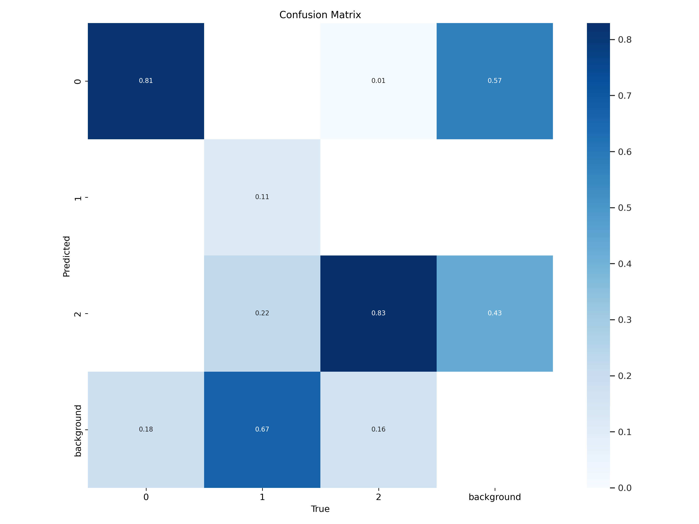
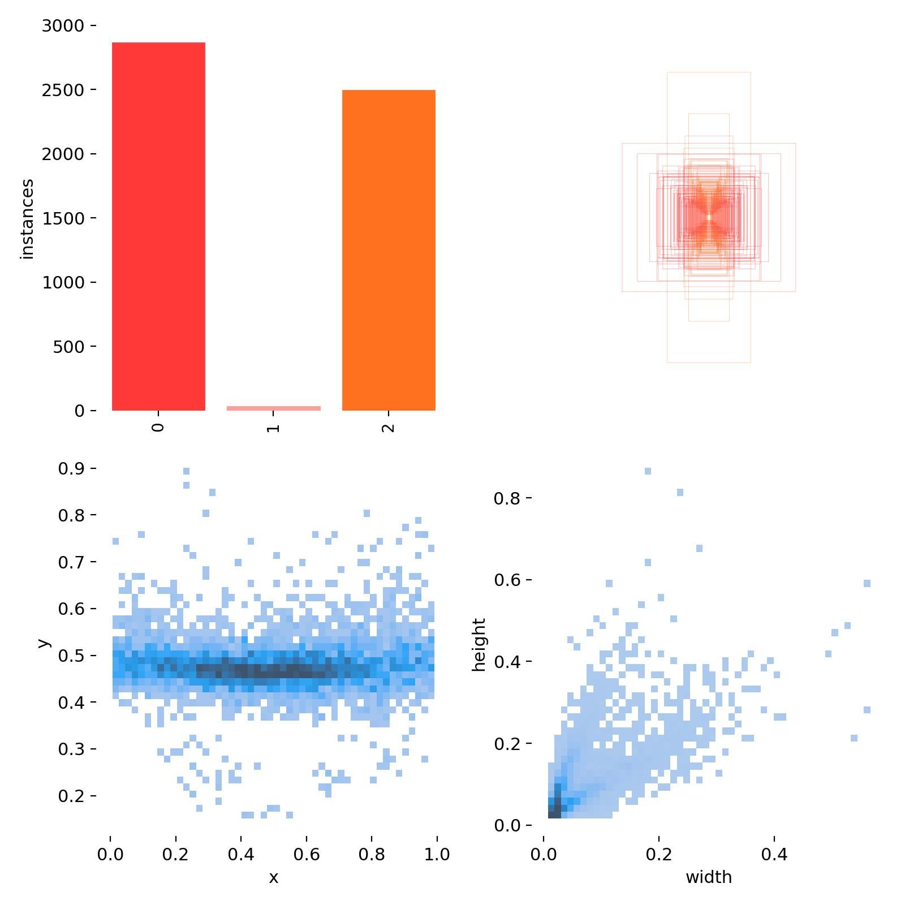
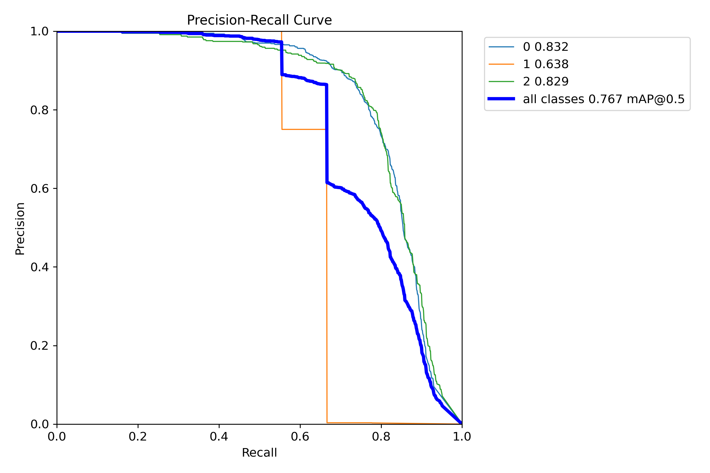

# YOLO Variant Benchmarking for Thermal Images

## Description

A research artifact repository for thermal-image object detection experiments, including YOLO result plots, dataset metadata, reports, presentations, and supporting documents.

## Key Features

- Thermal image object detection research assets
- Training curves and confusion matrix outputs
- Roboflow dataset metadata
- Research documents, reports, and presentations
- YAML configuration and results CSV files

## Tech Stack

- YOLO object detection
- Roboflow metadata
- YAML configs
- Research documents
- Training result plots

## Installation

No installation is required to review the included research assets.

## Usage

Review the documents, YAML files, CSV metrics, and result images. Add a training notebook/script later for full reproducibility.

## Screenshots

## License

No license file is currently included. Add a license before reusing, distributing, or publishing this project for public collaboration.

